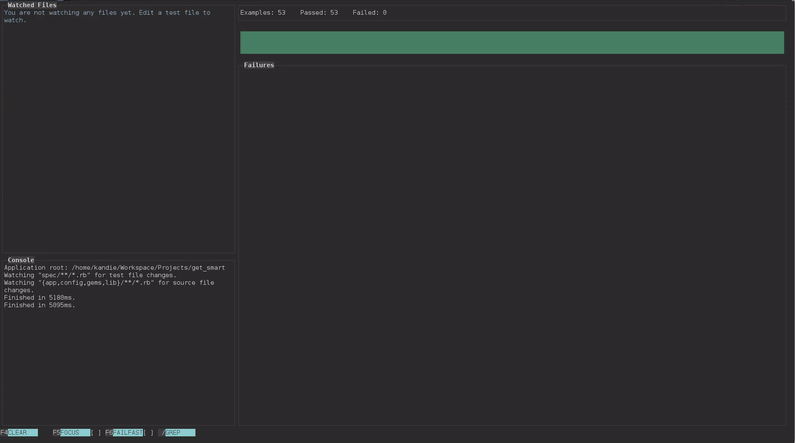

# goro 

An RSpec runner for a TDD-style workflow: it tracks the specs as you write and
edit them and re-runs rspec for you. Sort of like using Guard with rspec with 
the difference in reporting; goro can run multiple rspec threads in parallel 
and consolidate the output into a single report.

## Usage

Get it first:

    npm install -g goro

Then run it in the root directory of your (Rails) app (where `spec/` and `bin/` reside for default Rails apps.)

    goro

Run with `--help` to see the available options.

## Concurrency

It is possible to have goro distribute the test files to several RSpec processes and run them in parallel. If you do so, it will aggregate the output of all processes and present them in a single report.

You need to have a database for each thread you want to run. goro will specify
the database number in an environment variable `TEST_ENV_NUMBER` which you should use to switch to the proper db in rspec.

Once you have enough databases set-up, run goro with the `-j` flag:

    goro -j 4

Executing specs across multiple processes definitely has a diminishing return; I found the sweet spot to be 4 but YMMV.

### Shuffling test files

This option makes goro shuffle the test files around before it assigns them to the execution threads. The reason why this might be useful is explained below.

If you grep for many specs, they will be run in the order as they appear on the file system and that ordering may not be beneficial for maximum speed; for example, specs under the `controllers/` folder might take much longer than ones under `helpers/` so if we jam most of the controller specs on the same thread, it will most definitely last longer and you gain less from concurrency.

Obviously, this option is only useful when you're using more than 1 thread.

    goro -j 4 --shuffle -g Account

The above command will run all specs that have anything to do with "Account", shuffle the list of files that match, then distribute them to 4 different threads.

## Tuning to the environment

goro tries to make few assumptions about how you run your specs and where they're located and exposes a few options to tune these:

- the rspec binary to use for launching threads can be specified using `--rspec-binary`, this defaults to `bin/rspec` assuming you use Spring with Rails
- the pattern of specs it tracks is defaulted to `_spec.rb` and can be tuned using `--spec-pattern`
- you can make goro watch source files for changes and re-run the specs on such events using `--watch-source-pattern`

## Features

### The cache

_TODO_

### Focus mode

_TODO_

### Fail-fast mode

_TODO_

### Grepping

## Changelog

### 1.1.0

- support for tracking RSpec pending specs
- moved the console widget to its own panel which now contains goro's messages as well as RSpec's stdout/stderr streams. The console panel can be activated using `TAB`.
- added an "Elapsed" stopwatch-style timer to the "Latest Run" stats box.
- a few UI enhancements
- (bugfix) RSpec warnings/stderr output are no longer treated like spec failures, instead they are redirected to the Console widget.

### 1.0.5

- regular STDOUT output from RSpec is now forwarded to the Console section
  in the reporter
- Ruby errors are now displayed in the Failures section of the reporter
- no longer printing the "Delayed execution; ..." message in the console
  as there is already an indicator for it in the status bar
- added a text reporter that can be engaged by supplying `--reporter text` 
  which will not engage the blessed UI

## License

The MIT License (MIT)

Copyright (c) 2015 Instructure, Inc.

Permission is hereby granted, free of charge, to any person obtaining a copy
of this software and associated documentation files (the "Software"), to deal
in the Software without restriction, including without limitation the rights
to use, copy, modify, merge, publish, distribute, sublicense, and/or sell
copies of the Software, and to permit persons to whom the Software is
furnished to do so, subject to the following conditions:

The above copyright notice and this permission notice shall be included in all
copies or substantial portions of the Software.

THE SOFTWARE IS PROVIDED "AS IS", WITHOUT WARRANTY OF ANY KIND, EXPRESS OR
IMPLIED, INCLUDING BUT NOT LIMITED TO THE WARRANTIES OF MERCHANTABILITY,
FITNESS FOR A PARTICULAR PURPOSE AND NONINFRINGEMENT. IN NO EVENT SHALL THE
AUTHORS OR COPYRIGHT HOLDERS BE LIABLE FOR ANY CLAIM, DAMAGES OR OTHER
LIABILITY, WHETHER IN AN ACTION OF CONTRACT, TORT OR OTHERWISE, ARISING FROM,
OUT OF OR IN CONNECTION WITH THE SOFTWARE OR THE USE OR OTHER DEALINGS IN THE
SOFTWARE.